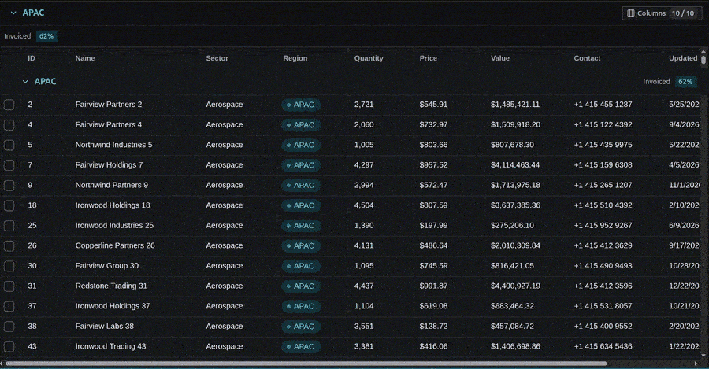
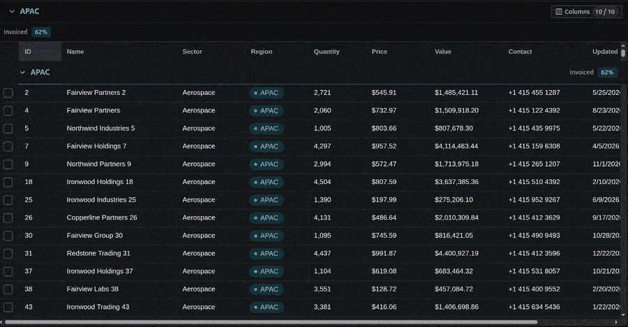
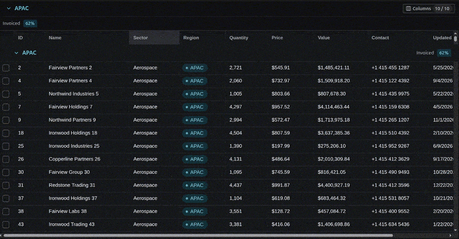

# @matthewhsu1/datagrid

A virtualised, server-paged data grid engine for React, built over
[glide-data-grid](https://github.com/glideapps/glide-data-grid).

It is the parts a spreadsheet-shaped page needs and a renderer does not give
you: a windowed page loader, a row cache that evicts, optimistic edits with
rollback, cross-client row sync, grouping with collapse, sorting, persisted
column layout, and typed cell editors — all against a server that holds far
more rows than the browser ever will.

> **Status: 0.x.** The API will break between minor versions. It is pinned to a
> **pre-release** build of glide-data-grid (`6.0.4-alpha24`). This is not a
> choice: glide's latest stable release, `6.0.3`, declares a React peer of
> `^16.12.0 || 17.x || 18.x`. React 19 support first appears in the `6.0.4`
> alpha line. The pin loosens when glide ships a stable `6.0.4`.

## What it looks like

All three clips are the demo in this repo: 100,000 synthetic rows behind a Mock
Service Worker.

### Scrolling

Pages load into the window as it moves, and evict behind it. The row count is
the server's, not the browser's.



### Grouping and sorting

A collapse tells the server to leave those rows out, so the total changes with
it. The old rows stay on screen while the new view loads behind them.



### Editing

An edit shows immediately and is sent behind it. A rejection rolls the cell back
and says why.



## Install

```bash
npm i @matthewhsu1/datagrid
```

It expects these to already be in your app:

```bash
npm i react react-dom react-redux @reduxjs/toolkit @tanstack/react-query \
      @radix-ui/themes @glideapps/glide-data-grid@6.0.4-alpha24
```

## Quick start

Full detail — every option, its default, and the traps — is in
[`docs/examples/configuration.md`](./docs/examples/configuration.md). This is the shortest path
that works.

```ts
// 1. Styles, once at your entry point.
import "@matthewhsu1/datagrid/radix-styles";
import "@matthewhsu1/datagrid/datagrid.css";

// 2. Point the grid at your accent, once, before the first grid renders.
configureGridTheme({ accentColor: "grass", grayColor: "slate" });

// 3. Describe the columns. Each names its cell by type, the way glide does.
const COLUMN_DEFS = {
  reference: {
    field: "reference",
    title: "Ref",
    defaultWidth: 160,
    editable: false,
    type: "dg:text",
  },
  total: {
    field: "total",
    title: "Total",
    defaultWidth: 120,
    editable: true,
    type: "dg:number",
    options: { format: "currency", currency: "USD" },
  },
  customer: {
    field: "customer",
    title: "Customer",
    defaultWidth: 200,
    editable: true,
    type: "text",
  }, // one of glide's own kinds
};

// 4. Describe one grid.
const orderGrid = createGridInstance({
  name: "orders",
  rowKey: (row) => row.id,
  columns: { defs: COLUMN_DEFS, defaultOrder: ["reference", "total", "customer"] },
  api: { fetchRows, fetchCount, fetchRow, updateRow },
});

// 5. Mount its reducer under the descriptor's name, then render.
//    <DataGrid instance={orderGrid} />
```

Nothing registers a cell: the five the engine draws are prefixed `dg:`, glide's
own kinds keep glide's own names, and the user's column layout is remembered in
Web Storage on its own.

The grid needs a Redux store and a `QueryClientProvider` above it. It creates
its own `<div id="portal">` if your page has none — without one, no cell can be
edited and nothing says so.

## Run the demo

```bash
npm install
npm run dev
```

100,000 synthetic rows served by a Mock Service Worker, with every cell type,
grouping, sorting, editing, and a control bar for latency and failure rates.
The demo consumes the package **by name**, aliased to source — so if the public
surface is not enough to build an app, the demo stops building.

## What is public

Only what `src/index.ts` re-exports, plus `@matthewhsu1/datagrid/testing`. Deep
imports are blocked by `exports`, deliberately: everything else is free to move
in a patch release. Every public symbol is documented in
[`docs/examples/configuration.md`](./docs/examples/configuration.md).

## Vocabulary

[`CONTEXT.md`](./CONTEXT.md) defines every term this codebase uses — _hold_,
_span_, _display model_, _data generation_, and the rest. Read it before
changing anything in `src/features/dataGrid/`.

## Develop

```bash
npm test           # 669 tests
npm run typecheck
npm run check:docs # typechecks every code block in docs/
npm run lint
npm run build      # dist/ — JS, .d.ts, and datagrid.css
```

`just check` runs all five in one go.

## Licence

MIT
